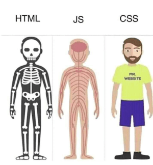

## HTML & CSS cookbook by hangull
Table of Contents
---
---
- [Introduction](#Introduction)
- [HTML](#HTML)
# Introduction
- HTML scheletro, struttura
- CSS style, rifinitura



# HTML
```html
<!DOCTYPE html><!--Specifica il tipo di documento, primo TAG da includere nel documento-->
<html>
  <head>
    <title>Document title</title>
    <meta charset="UTF-8">
    <meta name="viewport" content="width=device-width, initial-scale=1.0"><!--user's visible area of the page, ottimo meta per gli smartphone-->
  </head><!--metatag e.g. charset, viewport, ... + descrizione, titolo, fogli di stile, script, font, logiche di zoom...-->
  <body></body>
</html><!--TAG che include tutto il resto del documento, HEAD e BODY-->
```
